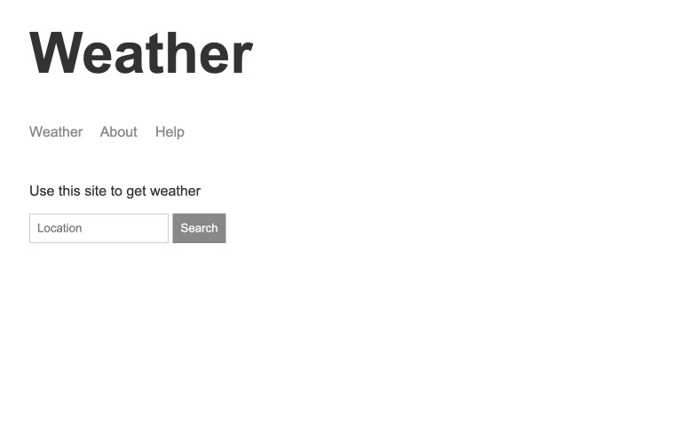

# Weather App

This was built using NodeJS, and gathers user input to fetch geolocation data from MapBox API, and then feeds that data to the WeatherBug API to fetch accurate weather data.

I built this website while following along with [Andrew Mead's NodeJS course](https://www.udemy.com/course/the-complete-nodejs-developer-course-2/), and it has been deployed using Heroku at https://khare-weather-application.herokuapp.com/.
